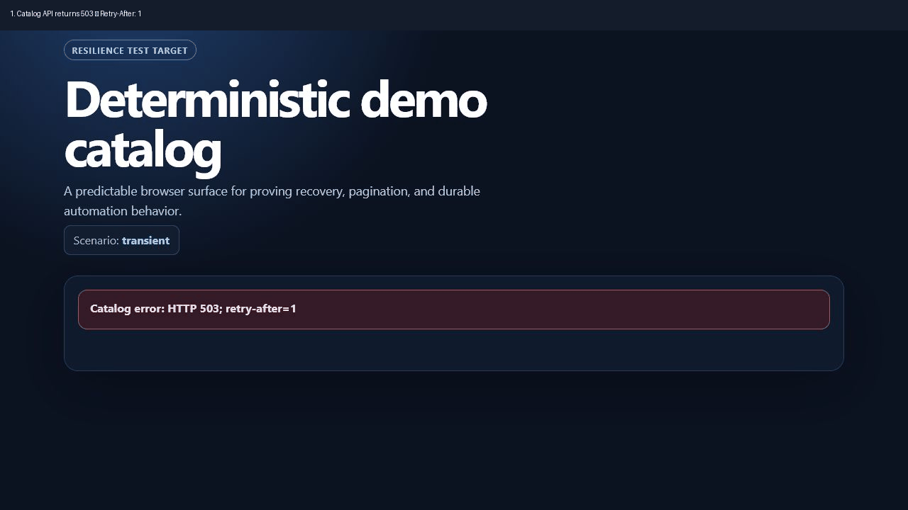

# Resilient Automation Test Stand

[](https://github.com/bockuden/resilient-automation-test-stand/actions/workflows/tests.yml)
[](pyproject.toml)
[](LICENSE)

Test whether browser automation recovers from real, repeatable failures—not
just happy-path responses. This FastAPI stand supplies deterministic retries,
pagination, login, DOM changes, duplicates, cancellation, and resume cases for
Playwright, Selenium, and any HTTP-aware worker.

The stand is deliberately stateful within one process: retry counters are
isolated by `run_id` and can be reset between test cases. It is test
infrastructure and is not intended to serve production traffic.

## Run a failure-and-recovery scenario in three commands

```bash
docker compose up --build --detach --wait
```

Open the following URL in a browser or let an automation worker navigate to it:

```text
http://localhost:8080/catalog?scenario=transient&run_id=readme-demo&fail_for=2
```

Then stop the stand:

```bash
docker compose down
```

The first two catalog API requests return `503` and `Retry-After: 1`; later
requests for the same `run_id` succeed. Use a new `run_id` for an independent
test run.



## Who this is for

- QA and SDET engineers validating retry, timeout, checkpoint, and evidence
  handling in browser workers.
- Scraping and data engineers who need a deterministic target for pagination,
  duplicates, DOM changes, and resumable collection.
- Library authors who want contract fixtures before integrating with a variable
  third-party website.
- Educators teaching resilient automation without depending on a live site.

## Why not use an ordinary mock server?

An ordinary mock often returns one static response. This stand keeps a small,
isolated state machine per `run_id`, so a consumer has to prove its behavior
across an ordered sequence of requests.

| Failure mode | What a consumer can prove |
| --- | --- |
| `transient` | It honors `Retry-After`, limits retries, and eventually succeeds. |
| `resume` | It saves progress and resumes after a permanent page failure. |
| `dom-change` | It relies on stable `data-testid` locators rather than CSS shape. |
| `duplicates` | It deduplicates items across pagination boundaries. |
| `protected` | It preserves the demo login session and return URL. |

## Quick start with Python

Requirements: Python 3.11 or newer.

Only virtual-environment creation and activation differ by platform.

Windows PowerShell:

```powershell
python -m venv .venv
.\.venv\Scripts\Activate.ps1
```

Linux and macOS:

```bash
python3 -m venv .venv
source .venv/bin/activate
```

After activation, installation and startup are identical in PowerShell, Linux,
and macOS shells:

```bash
python -m pip install -e '.[dev]'
automation-test-stand --port 8080
```

The module entry point is equivalent on every platform:

```bash
python -m resilient_automation_test_stand --port 8080
```

## Docker Compose details

These commands are the same in PowerShell, Linux shells, and macOS Terminal:

```bash
docker compose up --build --detach --wait
docker compose down
```

Check readiness while the service is running.

Windows PowerShell:

```powershell
Invoke-RestMethod http://localhost:8080/health
```

Linux and macOS:

```bash
curl --fail http://localhost:8080/health
```

The development image is named `resilient-automation-test-stand:dev`.
Released images are published as
`ghcr.io/bockuden/resilient-automation-test-stand:<version>`.

## Troubleshooting

| Symptom | Resolution |
| --- | --- |
| Port `8080` is already in use | Change the Compose port mapping or stop the process that owns the port, then run `docker compose up --build --detach --wait` again. |
| A transient scenario succeeds or fails at an unexpected attempt | Use a new `run_id`, or call `POST /admin/reset` before the test. Counters are intentionally shared only within one `run_id`. |
| A protected catalog returns the login form again | Preserve the `demo_session` cookie after submitting the login form; direct API requests to `/api/catalog` do not require it. |
| Docker cannot run the image on the current machine | Use a Docker engine that can run the image platform, or run the Python quick start locally instead. |

## Demo authentication

Add `protected=true` to a `/catalog` URL, or select a preset with
`protected = true`, to redirect the browser to the login form. The credentials
are fixed test-stand values:

| Value | Input |
| --- | --- |
| Username | `demo` |
| Password | `automation` |

They are intentionally not configured in `scenarios.toml`. That file selects
whether login is required; a user enters the values above in the form, while an
automation script fills `input[name="username"]` and
`input[name="password"]`, then submits the form.

The equivalent form request is:

```http
POST /login
Content-Type: application/x-www-form-urlencoded

username=demo&password=automation&next_url=/catalog?protected=true
```

Successful login sets the `demo_session=authenticated` cookie and redirects
back to `next_url`. A script that posts the form directly must preserve this
cookie for the following `/catalog` request. Authentication protects the
browser catalog route; `/api/catalog` remains directly accessible for API-only
tests.

## Scenario cookbook

Start the server first, then use one of the commands below. Protected scenarios
redirect to the demo login form described above.

### Windows PowerShell

```powershell
$catalog = 'http://localhost:8080/catalog'

# Ten successful catalog pages.
Start-Process "$catalog?scenario=success&run_id=ten-pages&total_pages=10"

# Login, then ten successful catalog pages.
Start-Process "$catalog?protected=true&scenario=success&run_id=login-ten-pages&total_pages=10"

# Login, then two delayed 503 responses per page before recovery.
Start-Process "$catalog?protected=true&scenario=transient&run_id=login-delayed-503&total_pages=10&fail_for=2&failure_delay_ms=1500"
```

### Linux

```bash
catalog='http://localhost:8080/catalog'

xdg-open "${catalog}?scenario=success&run_id=ten-pages&total_pages=10"
xdg-open "${catalog}?protected=true&scenario=success&run_id=login-ten-pages&total_pages=10"
xdg-open "${catalog}?protected=true&scenario=transient&run_id=login-delayed-503&total_pages=10&fail_for=2&failure_delay_ms=1500"
```

### macOS

```bash
catalog='http://localhost:8080/catalog'

open "${catalog}?scenario=success&run_id=ten-pages&total_pages=10"
open "${catalog}?protected=true&scenario=success&run_id=login-ten-pages&total_pages=10"
open "${catalog}?protected=true&scenario=transient&run_id=login-delayed-503&total_pages=10&fail_for=2&failure_delay_ms=1500"
```

The delayed transient example waits 1.5 seconds before each of the first two
`503` responses on every page. A manual browser displays the error and can be
reloaded; an automation worker can exercise its retry policy and recover on the
third attempt.

## Python Playwright: retry a transient browser scenario

Install the Python Playwright package and browser once, then run this while the
Compose service above is running:

```bash
python -m pip install playwright
playwright install chromium
```

```python
import time

from playwright.sync_api import TimeoutError as PlaywrightTimeoutError
from playwright.sync_api import expect, sync_playwright

url = (
    "http://localhost:8080/catalog?scenario=transient"
    "&protected=true&run_id=playwright-readme&fail_for=2"
)

with sync_playwright() as playwright:
    browser = playwright.chromium.launch()
    page = browser.new_page()
    page.goto(url)
    page.get_by_label("Username").fill("demo")
    page.get_by_label("Password").fill("automation")
    with page.expect_navigation():
        page.get_by_role("button", name="Sign in").click()

    for attempt in range(1, 4):
        try:
            expect(page.get_by_test_id("catalog-item").first).to_be_visible(timeout=2_000)
            break
        except PlaywrightTimeoutError:
            expect(page.get_by_test_id("catalog-error")).to_contain_text("HTTP 503; retry-after=1")
            time.sleep(1)
            page.reload()
    else:
        raise RuntimeError("The transient scenario did not recover within its retry budget")

    expect(page.get_by_test_id("catalog-item")).to_have_count(5)
    browser.close()
```

The stand does not retry for the consumer: the example makes the retry budget
and `Retry-After` wait explicit, then proves that the third browser load
recovers.

For a production-style .NET consumer with retries, checkpoints, cancellation,
and browser evidence, see
[resilient-browser-automation](https://github.com/bockuden/resilient-browser-automation).

## Resilience Challenge

Work through the four-level, reproducible
[Resilience Challenge](CHALLENGE.md) to validate a consumer against success,
transient recovery, login, DOM changes, duplicates, resume, and cancellation.

## Named scenario presets

For repeated scenarios, the same values can be stored in a TOML file instead
of copied into every startup command. The repository includes
[`examples/scenarios.toml`](examples/scenarios.toml) with the three cookbook
scenarios above.

These CLI commands are identical in PowerShell, Linux, and macOS shells:

```bash
automation-test-stand --config examples/scenarios.toml --list-presets
automation-test-stand --config examples/scenarios.toml --print-url login-delayed-retry
automation-test-stand --config examples/scenarios.toml --preset login-delayed-retry --port 8080
```

`--print-url` emits a self-contained URL that no longer depends on the config
file. `--preset` starts the server with that preset as its defaults. An explicit
query parameter overrides only the matching preset field, so the following URL
uses the preset's ten pages but disables its transient failures:

```text
http://localhost:8080/catalog?scenario=success&run_id=override-example
```

Preset files use this shape; omitted fields inherit the built-in defaults:

```toml
[presets.login-delayed-retry]
protected = true
scenario = "transient"
total_pages = 10
fail_for = 2
failure_delay_ms = 1500
```

To fetch all ten pages directly from the API, use either loop below.

Windows PowerShell:

```powershell
1..10 | ForEach-Object {
    Invoke-RestMethod "http://localhost:8080/api/catalog?scenario=success&run_id=api-ten-pages&page=$_&total_pages=10"
}
```

Linux and macOS:

```bash
page=1
while [ "$page" -le 10 ]; do
  curl --fail "http://localhost:8080/api/catalog?scenario=success&run_id=api-ten-pages&page=${page}&total_pages=10"
  printf '\n'
  page=$((page + 1))
done
```

## Endpoints

| Method | Path | Purpose |
| --- | --- | --- |
| `GET` | `/health` | Container and service readiness |
| `GET` | `/catalog` | JavaScript-rendered catalog and pagination shell |
| `GET` | `/api/catalog` | Deterministic paginated catalog data |
| `GET` | `/login` | Predictable login form |
| `POST` | `/login` | Authenticate the demo user and set a session cookie |
| `POST` | `/admin/reset` | Clear all in-memory attempt counters |
| `GET` | `/api-docs` | Interactive OpenAPI documentation |

## Scenario parameters

Both `/catalog` and `/api/catalog` accept the parameters below. `/api/catalog`
also accepts `page` from 1 through 20.

| Parameter | Built-in default | Meaning |
| --- | --- | --- |
| `scenario` | `success` | Selects the deterministic behavior described below |
| `run_id` | `manual` | Isolates request-attempt counters between test cases |
| `total_pages` | `4` | Number of catalog pages to expose (1-20) |
| `fail_for` | `2` | Initial `503` responses per page in `transient` (0-10) |
| `failure_delay_ms` | `0` | Delay before each transient `503` response (0-30000 ms) |
| `delay_ms` | `1500` | Delay per API request in `slow` (0-30000 ms) |
| `fail_page` | `3` | Permanently failing page in `resume` (1-20) |
| `protected` | `false` | Require the demo login before serving `/catalog` |

## Scenarios

| Scenario | Behavior |
| --- | --- |
| `success` | Returns `total_pages` pages of five unique items each |
| `transient` | Returns `503` with `Retry-After: 1` for the first `fail_for` attempts of each page, then recovers |
| `permanent` | Always returns `500` from the catalog API |
| `slow` | Delays every catalog API response by `delay_ms`, enabling timeout and cancellation tests |
| `resume` | Loads other pages but returns `500` on `fail_page`, enabling durable checkpoint and resume tests |
| `dom-change` | Changes catalog element names and CSS classes while preserving stable `data-testid` locators |
| `duplicates` | Repeats the previous page's final item as the next page's first item |

The same `run_id`, scenario, and page share an attempt counter. Call
`POST /admin/reset` or choose a fresh `run_id` when a test needs clean state.

## Development and contract checks

After activating the virtual environment:

```bash
python -m pip install -e '.[dev]' build
python -m pytest
python scripts/export_openapi.py --check
python -m build
```

The committed contract is [docs/api/openapi.json](docs/api/openapi.json). If an
endpoint or model changes, regenerate it with:

```bash
python scripts/export_openapi.py
```

Contract changes require an updated snapshot, [release notes](CHANGELOG.md), a
package version change, and a backward-compatibility review. The release
roadmap is tracked in [the development plan](docs/development-plan.md). The
intended 1.0 public contract and compatibility policy are documented in
[docs/compatibility.md](docs/compatibility.md). Release prerequisites and the
one-time PyPI Trusted Publisher setup are documented in
[docs/release-checklist.md](docs/release-checklist.md).

## License

MIT. See [LICENSE](LICENSE).
